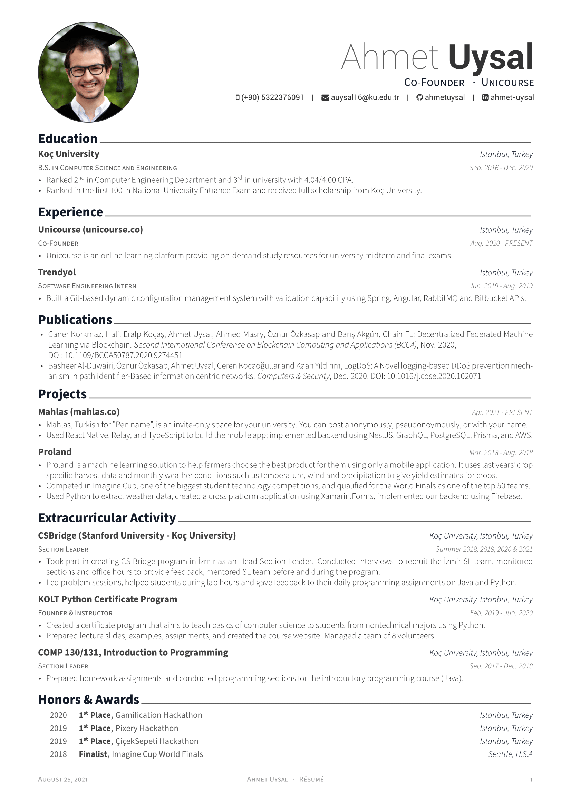

# Résumé

## Preview

You can also [see](https://github.com/ahmetuysal/Resume/blob/master/resume.pdf) or [download](https://raw.githubusercontent.com/ahmetuysal/Resume/master/resume.pdf) the PDF version.

## Credit

[**Awesome CV**](https://github.com/posquit0/Awesome-CV) is LaTeX template for a **CV(Curriculum Vitae)**, **Résumé** or **Cover Letter** inspired by [Fancy CV](https://www.sharelatex.com/templates/cv-or-resume/fancy-cv). It is easy to customize your own template, especially since it is really written by a clean, semantic markup.

[**LaTeX**](http://www.latex-project.org) is a fantastic typesetting program that a lot of people use these days, especially the math and computer science people in academia.

[**LaTeX FontAwesome**](https://github.com/furl/latex-fontawesome) is bindings for FontAwesome icons to be used in XeLaTeX.

[**Roboto**](https://github.com/google/roboto) is the default font on Android and ChromeOS, and the recommended font for Google’s visual language, Material Design.

[**Source Sans Pro**](https://github.com/adobe-fonts/source-sans-pro) is a set of OpenType fonts that have been designed to work well in user interface (UI) environments.
